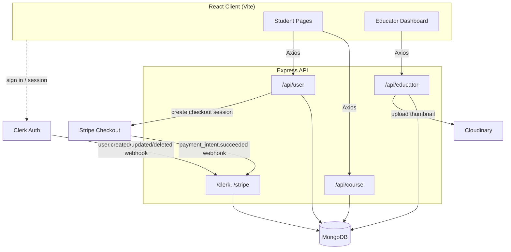
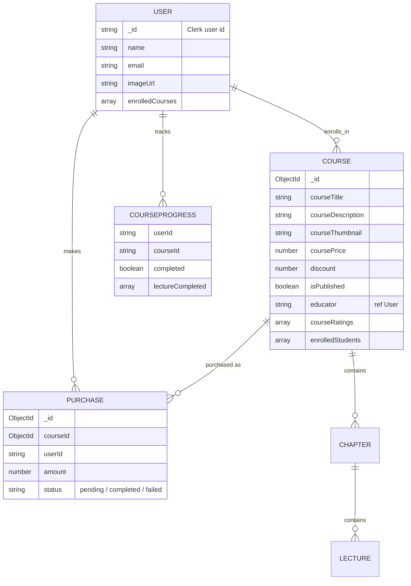
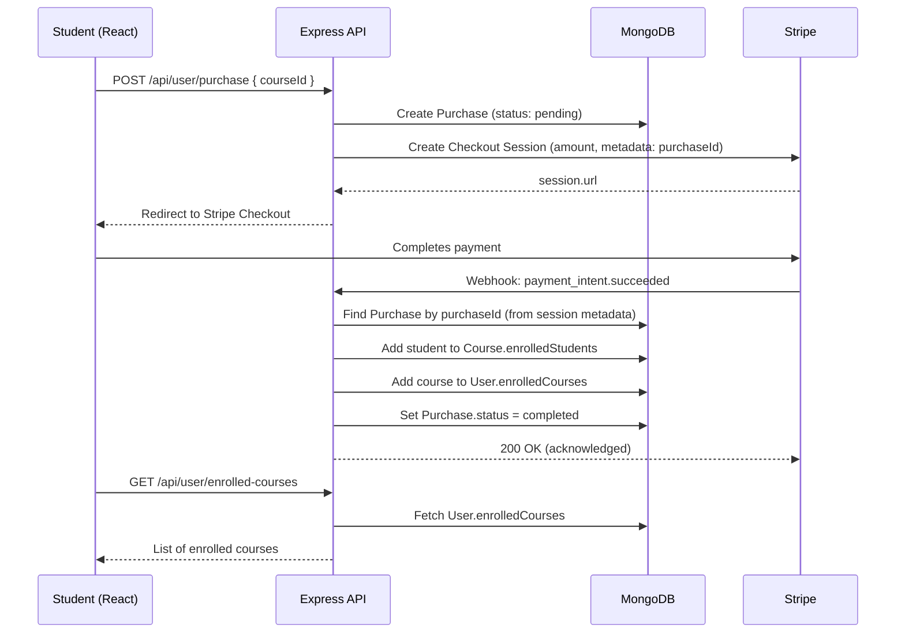

# Trainology

A full-stack online learning platform (an e-learning marketplace, similar in spirit to Udemy) where **educators** can create and sell video courses, and **students** can browse, purchase, and track progress through them. Built with the MERN stack, integrated with Clerk for authentication, Stripe for payments, and Cloudinary for media storage.

## Overview

Trainology has two user roles sharing one codebase:

- **Students** browse a course catalog, view course details and free preview lectures, purchase courses via Stripe, track lecture-by-lecture progress, and rate completed courses.
- **Educators** get a dedicated dashboard to create courses (with chapters and lectures), upload thumbnails, and view earnings and enrolled-student data.

Role switching is handled through Clerk's user metadata rather than a separate signup flow — any signed-in user can become an educator, and route access is enforced server-side based on that role.

## Tech Stack

| Layer | Technology |
|---|---|
| Frontend | React 19, React Router, Tailwind CSS, Vite |
| Backend | Node.js, Express 5 |
| Database | MongoDB with Mongoose |
| Authentication | Clerk (`@clerk/express`, `@clerk/clerk-react`) |
| Payments | Stripe Checkout + Webhooks |
| Media Storage | Cloudinary (course thumbnails) + Multer (upload handling) |
| Rich Text | Quill (course description editor) |
| Video | react-youtube |
| Other | Axios, react-toastify, rc-progress, react-simple-star-rating |

## Architecture

The frontend and backend are fully decoupled: the React SPA talks to the Express API over REST, while two external services — Clerk and Stripe — push events back to the server via webhooks to keep user records and payment status in sync.



## Data Model



## Course Purchase Flow

This is the most involved flow in the app — it spans the client, the Express API, Stripe, and a webhook callback that finalizes enrollment only after payment actually succeeds (never optimistically on the client).



## Features

**Student side**
- Browse and search all published courses
- View course details, curriculum (chapters/lectures), and free preview lectures
- Purchase courses through Stripe Checkout
- Track per-lecture completion progress
- Rate purchased/enrolled courses (1–5 stars)
- "My Enrollments" page listing all purchased courses

**Educator side**
- One-click role upgrade from student to educator (via Clerk metadata)
- Create courses with a rich-text description editor (Quill), chapters, lectures, pricing, and discounts
- Upload course thumbnails (stored on Cloudinary)
- Dashboard showing total courses, total earnings, and enrolled students
- View enrolled-student list per course with purchase dates

**Platform**
- Clerk-based authentication with automatic user sync into MongoDB via webhooks
- Stripe webhook-driven enrollment (payment confirmation happens server-side, not client-side, to prevent granting access on unconfirmed payments)
- Role-protected educator routes via Express middleware

## Project Structure

```
TrainologyProject/
├── client/                    # React frontend (Vite)
│   └── src/
│       ├── components/
│       │   ├── student/       # Navbar, Hero, CourseCard, Rating, etc.
│       │   └── educator/      # Sidebar, Navbar, Footer for educator UI
│       ├── pages/
│       │   ├── student/       # Home, CoursesList, CourseDetails, Player, MyEnrollments
│       │   └── educator/      # Dashboard, AddCourse, MyCourses, StudentsEnrolled
│       └── context/           # AppContext (global state)
└── server/                    # Express backend
    ├── models/                 # User, Course, Purchase, CourseProgress
    ├── controllers/            # userController, courseController, educatorController, webhooks
    ├── routes/                 # userRoutes, courseRoute, educatorRoutes
    ├── middlewares/             # authMiddleware (protectEducator)
    └── configs/                # mongodb, cloudinary, multer
```

## Getting Started

### Prerequisites

- Node.js (v18+ recommended)
- A MongoDB connection string (Atlas or local)
- Clerk account (API keys + webhook secret)
- Stripe account (API keys + webhook secret)
- Cloudinary account (for thumbnail uploads)

### Environment Variables

**server/.env**
```
PORT=5000
MONGODB_URI=your_mongodb_connection_string
CLERK_WEBHOOK_SECRET=your_clerk_webhook_secret
CLOUDINARY_NAME=your_cloudinary_cloud_name
CLOUDINARY_API_KEY=your_cloudinary_api_key
CLOUDINARY_SECRET_KEY=your_cloudinary_api_secret
STRIPE_SECRET_KEY=your_stripe_secret_key
STRIPE_WEBHOOK_SECRET=your_stripe_webhook_secret
CURRENCY=usd
```

**client/.env**
```
VITE_CLERK_PUBLISHABLE_KEY=your_clerk_publishable_key
VITE_BACKEND_URL=http://localhost:5000
VITE_CURRENCY=$
```

### Installation & Run

```bash
# Backend
cd server
npm install
npm run server        # runs with nodemon

# Frontend (in a separate terminal)
cd client
npm install
npm run dev
```

The client runs on Vite's default dev port (typically `http://localhost:5173`) and proxies API calls to the backend at the URL set in `VITE_BACKEND_URL`.

## Challenges Faced

- **Keeping enrollment consistent with actual payment status.** The naive approach would be to mark a student as enrolled the moment they click "purchase." Instead, a `Purchase` record starts as `pending`, and only the Stripe webhook (`payment_intent.succeeded`) — triggered by Stripe itself, not the client — updates it to `completed` and pushes the course into the user's `enrolledCourses`. This avoids granting access on payments that are abandoned or fail.
- **Handling two different body-parsing needs on one Express app.** Stripe and Clerk both require the *raw* request body to verify webhook signatures, but the rest of the API needs parsed JSON. This meant applying `express.raw()` specifically to the `/clerk` and `/stripe` routes before registering `express.json()` globally for everything else — ordering here matters, since Express applies middleware in sequence.
- **Syncing an external auth provider with the local database.** Clerk owns the source of truth for who a user is, but the app still needs its own `User` documents (to store `enrolledCourses`, for example). Clerk webhooks (`user.created`, `user.updated`, `user.deleted`) keep MongoDB in sync, which means the server has to trust and verify webhook payloads (via `svix`) rather than trusting client-supplied user data.
- **Modeling nested course content.** A course contains an ordered list of chapters, each containing an ordered list of lectures, each with its own metadata (duration, preview flag, video URL). This was modeled as nested Mongoose sub-schemas (`lectureSchema` inside `chapterSchema` inside `courseSchema`) rather than separate collections, since chapters/lectures are always accessed as part of their parent course.
- **Role-based access without a separate user table.** Rather than maintaining a separate "educators" collection, the educator role is stored in Clerk's `publicMetadata` and checked in Express middleware (`protectEducator`) on every educator-only route, keeping role state in one place instead of duplicating it across systems.

## Possible Improvements

- Server-side pagination and filtering for the course list at scale
- Refund/cancellation handling via additional Stripe webhook events
- Email notifications on purchase completion
- Video hosting migration from YouTube embeds to a dedicated video CDN with watch-time analytics
- Automated tests for the purchase and webhook flows (currently untested paths that are easy to silently break)

## What I'd Highlight in an Interview

This project is a good example of tying together three third-party systems (Clerk, Stripe, Cloudinary) behind a single Express API while keeping the client thin. The most interesting design decision to walk through is the **payment-to-enrollment flow**: why enrollment is driven by a server-verified webhook rather than the client's own "success" callback, and why that distinction matters for correctness in a real payment system. It's also a solid example of REST API design with role-based route protection and a relational-ish document schema (nested chapters/lectures) modeled in MongoDB.
